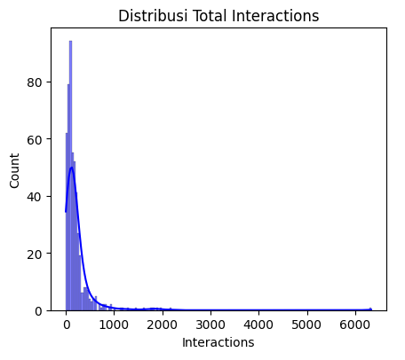
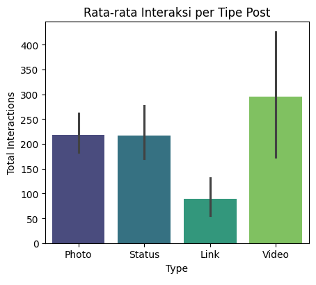
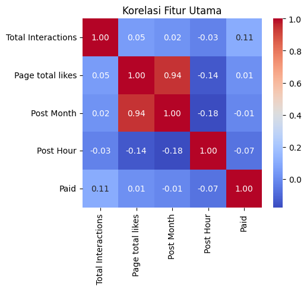
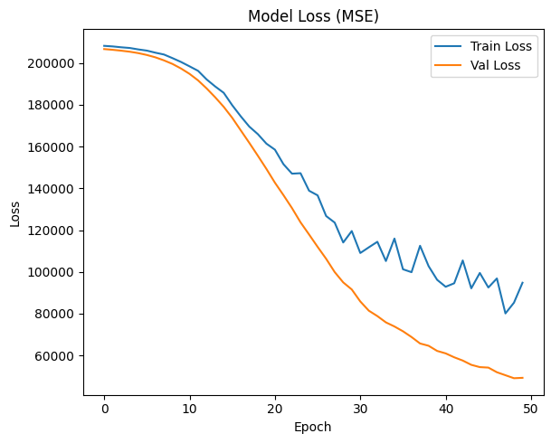
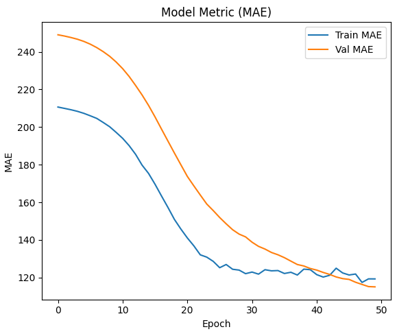
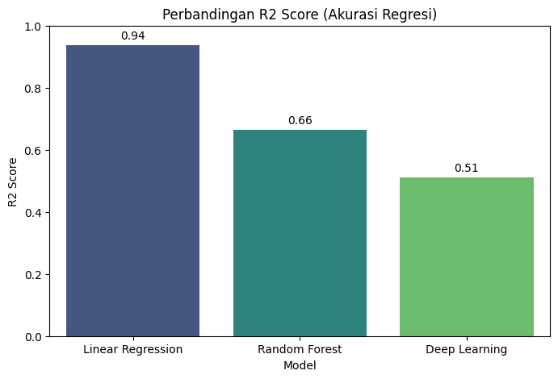

## INFORMASI PROYEK

**Judul Proyek:**  
"Analisis Prediksi Interaksi Postingan Facebook Menggunakan Machine Learning & Deep Learning"

**Nama Mahasiswa:** Shaffa Dwiaji Feryansyah Putra <br>
**NIM:** 234311028  <br>
**Program Studi:** Teknologi Rekayasa Perangkat Lunak <br>
**Mata Kuliah:** Data Science  <br>
**Dosen Pengampu:** Gus Nanang Syaifuddiin, S.Kom., M.Kom. <br>
**Tahun Akademik:** 2025/Ganjil (5) <br>
**Link GitHub Repository:** https://github.com/ShaffaDwiaji/DS_Project_UAS <br>
**Link Video Pembahasan:** https://youtu.be/pZfH3Jg2JBw

---

## 1. LEARNING OUTCOMES
Pada proyek ini, mahasiswa diharapkan dapat:
1. Memahami konteks masalah dan merumuskan problem statement secara jelas
2. Melakukan analisis dan eksplorasi data (EDA) secara komprehensif (**OPSIONAL**)
3. Melakukan data preparation yang sesuai dengan karakteristik dataset
4. Mengembangkan tiga model machine learning yang terdiri dari (**WAJIB**):
   - Model baseline
   - Model machine learning / advanced
   - Model deep learning (**WAJIB**)
5. Menggunakan metrik evaluasi yang relevan dengan jenis tugas ML
6. Melaporkan hasil eksperimen secara ilmiah dan sistematis
7. Mengunggah seluruh kode proyek ke GitHub (**WAJIB**)
8. Menerapkan prinsip software engineering dalam pengembangan proyek

---

## 2. PROJECT OVERVIEW

### 2.1 Latar Belakang
Dalam era pemasaran digital, kemampuan untuk memprediksi tingkat keterlibatan (engagement) audiens terhadap sebuah konten sangatlah krusial. Perusahaan seringkali menghabiskan sumber daya besar untuk membuat konten, namun hasilnya tidak selalu sesuai harapan.

Proyek ini bertujuan untuk membangun model prediksi jumlah interaksi (Total Interactions) pada laman Facebook merek kosmetik terkenal. Dengan memprediksi interaksi sebelum konten diterbitkan, manajer media sosial dapat mengoptimalkan strategi konten mereka untuk mendapatkan jangkauan maksimal.

Dataset yang digunakan berasal dari penelitian Moro et al. (2016) yang dipublikasikan di UCI Machine Learning Repository, mencakup 500 postingan dengan berbagai metrik kinerja.

**Referensi:**
> Moro, S., Rita, P., & Vala, B. (2016). Predicting social media performance metrics and evaluation of the impact on brand building: A data mining approach. Journal of Business Research.

## 3. BUSINESS UNDERSTANDING / PROBLEM UNDERSTANDING
### 3.1 Problem Statements

1. Manajer pemasaran kesulitan memperkirakan potensi viralitas atau interaksi sebuah postingan baru.
2. Belum diketahui fitur apa (Waktu posting, Tipe konten, atau Pembayaran) yang paling signifikan mendongkrak interaksi.
3. Diperlukan perbandingan performa antara model sederhana dan kompleks untuk menentukan alat prediksi yang paling efisien pada dataset berukuran kecil.

### 3.2 Goals

Tujuan harus spesifik, terukur, dan selaras dengan problem statement.
1. Membangun model regresi yang mampu memprediksi variabel Total Interactions dengan tingkat error serendah mungkin.
2. Mengukur performa tiga pendekatan model: Linear Regression (Baseline), Random Forest (Advanced), dan Multilayer Perceptron (Deep Learning).
3. Menentukan strategi konten terbaik berdasarkan hasil analisis fitur.

### 3.3 Solution Approach

Mahasiswa **WAJIB** menggunakan minimal **tiga model** dengan komposisi sebagai berikut:
- #### **Model 1 (Baseline) - Linear Regression:**
   Dipilih karena interpretabilitasnya yang tinggi dan kemampuannya menangkap hubungan linear yang kuat pada metrik media sosial.
- #### **Model 2 (Advanced) - Random Forest Regressor:**
   Dipilih karena ketangguhannya terhadap outliers dan kemampuan menangkap pola non-linear. Dilengkapi dengan Hyperparameter Tuning.
- #### **Model 3 (Deep Learning) - Multilayer Perceptron (MLP)**
   Dipilih untuk menguji apakah arsitektur neural network mampu mengekstrak fitur laten yang lebih kompleks dibanding metode klasik.

**Minimum Requirements untuk Deep Learning:**
- ✅ Model harus training minimal 10 epochs
- ✅ Harus ada plot loss dan accuracy/metric per epoch
- ✅ Harus ada hasil prediksi pada test set
- ✅ Training time dicatat (untuk dokumentasi)

**Tidak Diperbolehkan:**
- ❌ Copy-paste kode tanpa pemahaman
- ❌ Model tidak di-train (hanya define arsitektur)
- ❌ Tidak ada evaluasi pada test set

---

## 4. DATA UNDERSTANDING
### 4.1 Informasi Dataset
**Sumber Dataset:**  
https://archive.ics.uci.edu/dataset/368/facebook+metrics

**Deskripsi Dataset:**
- Jumlah baris (rows): 500
- Jumlah kolom (columns/features): 19
- Tipe data: Tabular
- Ukuran dataset: 15,9 KB
- Format file: CSV

### 4.2 Deskripsi Fitur
Jelaskan setiap fitur/kolom yang ada dalam dataset.

| Nama Fitur | Tipe Data | Deskripsi | Contoh Nilai |
| ---------- | --------- | --------- | ------------ |
| Page total likes | Integer | Jumlah pengikut halaman saat postingan dibuat | 139441 |
| Type | Kategorikal | Jenis konten | Link, Photo, Status, Video |
| Category | Integer | Kategori konten | 1, 2, 3 |
| Post Month | Integer | Bulan posting | (1-12) |
| Post Hour | Integer | Jam posting | (0-23) |
| Paid | Biner | Status berbayar | (0 = Tidak, 1 = Ya) |
| Lifetime Post Total Reach | Integer | Jumlah orang yang melihat postingan (Reach) | 2752, 10460 |


### 4.3 Kondisi Data
Jelaskan kondisi dan permasalahan data:
- **Missing Values:** Ada (Sangat Sedikit). Ditemukan data kosong pada kolom:
   - Paid: 1 data hilang (0.2%).
   - like: 1 data hilang (0.2%).
   - share: 4 data hilang (0.8%).
   - Dilakukan imputasi modus untuk kolom Paid dan penghapusan baris (drop rows) untuk like/share.
- **Duplicate Data:** Tidak Ada.
- **Outliers:** Terdeteksi outliers yang kuat pada fitur Total Interactions dan Lifetime Post Total Reach.
   - Bukti: Histogram menunjukkan distribusi data yang sangat miring ke kanan (right-skewed). Mayoritas postingan memiliki interaksi di bawah angka 500, namun terdapat segelintir postingan "viral" dengan interaksi ekstrem (di atas 2.000 hingga 6.000).
- **Imbalanced Data:** Ada (Pada Fitur Kategorikal). Ketidakseimbangan terjadi pada fitur input:
   - Fitur Type: Sangat didominasi oleh kategori 'Photo' (sekitar 85% data), sedangkan kategori 'Video' dan 'Status' jumlahnya sangat sedikit.
   - Fitur Paid: Mayoritas postingan adalah organik (Unpaid / 0), dengan rasio sekitar 3:1 dibandingkan postingan berbayar.
- **Noise:** Terdapat variasi yang besar pada fitur Lifetime Post Total Reach. Postingan dengan atribut waktu (Month, Hour) yang sama bisa memiliki jangkauan yang sangat berbeda jauh, mengindikasikan adanya faktor eksternal yang tidak terekam dalam dataset tabular ini.
- **Data Quality Issues:** Isu kualitas data terbesar pada dataset ini adalah adanya fitur yang menjadi bagian dari target. Kolom like, share, dan comment secara matematis jika dijumlahkan akan menjadi Total Interactions. Jika fitur ini tidak dibuang, model akan mengalami "kebocoran data" (akurasi palsu 100%).

### 4.4 Exploratory Data Analysis (EDA) - (**OPSIONAL**)

**Requirement:** Minimal 3 visualisasi yang bermakna dan insight-nya.
#### Visualisasi 1: Distribusi Total Interaction


**Insight:**  
Menunjukkan bahwa data Total Interactions memiliki distribusi skewed (miring ke kanan), di mana mayoritas postingan memiliki interaksi rendah, namun ada beberapa outliers (viral).

#### Visualisasi 2: Rata-Rata Interaksi per Post



**Insight:**  
Visualisasi Barplot menunjukkan perbedaan rata-rata interaksi antara tipe 'Photo', 'Video', dan 'Status'.

#### Visualisasi 3: Korelasi Fitur Utama



**Insight:**  
Menunjukkan adanya korelasi positif yang sangat kuat antara fitur jangkauan (Reach/Impressions) dengan target Total Interactions.

---

## 5. DATA PREPARATION

Bagian ini menjelaskan **semua** proses transformasi dan preprocessing data yang dilakukan.
### 5.1 Data Cleaning
**Aktivitas:**
- Handling Missing Values: Ditemukan missing values pada kolom Paid (diimputasi dengan Modus/0) dan pada like/share (baris dihapus karena jumlahnya tidak signifikan).
- Pencegahan Data Leakage: Menghapus kolom like, share, dan comment dari fitur input (X). Kolom-kolom ini adalah komponen pembentuk target Total Interactions, sehingga jika disertakan akan menyebabkan kebocoran data (model "mencontek" jawaban).

### 5.2 Feature Engineering
**Aktivitas:**
- Feature Selection (Pencegahan Data Leakage): Aktivitas utama yang dilakukan adalah menghapus (drop) fitur-fitur yang merupakan komponen pembentuk variabel target.
   - Fitur yang dihapus: like, share, dan comment.
   - Alasan: Variabel target Total Interactions adalah hasil penjumlahan dari like + share + comment. Jika fitur-fitur ini dimasukkan ke dalam data latih (X), model akan "curang" (mencontek jawaban) dan menghasilkan akurasi palsu (Data Leakage). Oleh karena itu, fitur ini wajib dieliminasi agar model hanya belajar dari atribut postingan (seperti Waktu, Tipe, dan Kategori).
- Dimensionality Reduction: Tidak dilakukan pengurangan dimensi (seperti PCA) karena jumlah fitur dataset relatif sedikit (< 20 fitur). Mempertahankan fitur asli dianggap lebih baik untuk menjaga interpretabilitas model (agar kita tahu persis pengaruh Post Hour atau Type terhadap interaksi).

### 5.3 Data Transformation

- **Encoding:** Menggunakan One-Hot Encoding pada kolom Type. Fitur ini diubah menjadi kolom biner (Type_Photo, Type_Video, dst) agar bisa diproses oleh Neural Network.
- **Scaling:** Menggunakan StandardScaler untuk menstandarisasi seluruh fitur numerik (Mean=0, Std=1). Hal ini krusial agar model Deep Learning dapat konvergen dengan baik.

### 5.4 Data Splitting

**Strategi pembagian data:**

Dataset dibagi menjadi tiga subset terpisah (Train, Validation, dan Test) dengan rasio proporsional 70:15:15. Pendekatan 3-way split ini dipilih untuk mengakomodasi kebutuhan training model Deep Learning yang memerlukan data validasi khusus untuk memantau performa per epoch.
```
- Training Set   : 70% (346 samples) - Digunakan untuk melatih bobot model.
- Validation Set : 15% (74 samples)  - Digunakan untuk evaluasi saat proses training (tuning).
- Test Set       : 15% (75 samples)  - Digunakan HANYA untuk evaluasi akhir (Unseen Data).
```

### 5.5 Data Balancing (jika diperlukan)

Data Balancing **tidak dilakukan** karena teknik penyeimbangan data (Data Balancing) seperti SMOTE atau Undersampling umumnya diterapkan pada kasus klasifikasi di mana terdapat ketimpangan jumlah kelas yang ekstrem.

### 5.6 Ringkasan Data Preparation

**Per langkah, jelaskan:**
1. **Apa** yang dilakukan
**[Jelaskan ]**
2. **Mengapa** penting
**[Jelaskan Mengapa ?]**
3. **Bagaimana** implementasinya
**[Jelaskan Bagaimana]**

| Langkah | Apa yang dilakukan | Mengapa penting | Bagaimana implementasinya |
| ------- | ------------------ | ---------------- | ------------------------- |
| 1. Data Cleaning | Menangani nilai yang hilang (missing values) pada kolom Paid, like, dan share. | Data kosong dapat menyebabkan error saat training model dan mengurangi akurasi prediksi. | - Mengisi Paid (biner) dengan Modus.<br>- Menghapus baris (drop rows) yang kosong pada kolom like/share karena jumlahnya < 1%.|
| 2. Feature Selection | Menghapus fitur like, share, dan comment dari variabel input (X). | Mencegah Data Leakage (kebocoran data). Target Total Interactions adalah penjumlahan dari ketiga fitur ini. Jika tidak dihapus, model akan "mencontek" jawaban. | Menggunakan fungsi df.drop(columns=['like', 'share', 'comment']). | 
| 3. Encoding | Mengubah data kategorikal Type (teks) menjadi format numerik. | Model Machine Learning (terutama Neural Network) hanya dapat memproses input berupa angka, bukan teks. | Menggunakan teknik One-Hot Encoding (pd.get_dummies) yang menghasilkan kolom biner baru (misal: Type_Photo, Type_Video). | 
| 4. Splitting | Membagi dataset menjadi 3 bagian: Train (70%), Validation (15%), dan Test (15%). | - Train: Untuk melatih model.<br>- Val: Untuk memantau performa saat training (mencegah overfitting).<br>- Test: Evaluasi akhir objektif. | Menggunakan fungsi train_test_split dari Scikit-Learn sebanyak dua tahap secara berurutan.
| 5. Feature Scaling | Menstandarisasi skala data numerik (Mean=0, Std=1). | Algoritma Deep Learning (MLP) sangat sensitif terhadap skala data. Data yang tidak diskalakan akan membuat proses konvergensi (gradient descent) menjadi lambat atau gagal. | Menggunakan StandardScaler. Scaler di-fit hanya pada data Train, lalu diterapkan (transform) ke data Val dan Test untuk mencegah kebocoran informasi. | 

---

## 6. MODELING
### 6.1 Model 1 — Baseline Model
#### 6.1.1 Deskripsi Model

**Nama Model:** Linear Regression
**Teori Singkat:**  
Linear Regression adalah algoritma statistik yang memodelkan hubungan antara variabel dependen (target) dan satu atau lebih variabel independen (fitur) dengan mencocokkan persamaan linear (garis lurus) pada data yang diamati. Tujuannya adalah meminimalkan jumlah kuadrat residu (Residual Sum of Squares) antara nilai aktual dan nilai prediksi.
**Alasan Pemilihan:**  
Model ini dipilih sebagai baseline karena kesederhanaannya, efisiensi komputasi yang tinggi, dan interpretabilitasnya. Mengingat target prediksi adalah nilai kontinu (jumlah interaksi), pendekatan linear menjadi titik awal yang logis untuk mengukur seberapa kompleks hubungan antar data.

#### 6.1.2 Hyperparameter
**Parameter yang digunakan:**
```
Pada model baseline ini, digunakan parameter default dari library Scikit-Learn:
- fit_intercept: True
- copy_X: True
- n_jobs: None
```

#### 6.1.3 Implementasi (Ringkas)
```python
from sklearn.linear_model import LinearRegression

# Definisi dan Training Model
model_lr = LinearRegression()
model_lr.fit(X_train_final, y_train)

# Prediksi pada Test Set
y_pred_lr = model_lr.predict(X_test_final)
```

#### 6.1.4 Hasil Awal

Model Linear Regression menunjukkan performa yang sangat baik dengan error yang rendah pada data uji. Detail perbandingan angka R2 Score dan RMSE akan dibahas secara mendalam di Section 7.

---

### 6.2 Model 2 — ML / Advanced Model
#### 6.2.1 Deskripsi Model

**Nama Model:** Random Forest Regressor
**Teori Singkat:**  
Random Forest adalah metode ensemble learning yang bekerja dengan membangun banyak pohon keputusan (decision trees) selama pelatihan. Untuk tugas regresi, model ini mengambil rata-rata (mean) dari prediksi setiap pohon individu. Metode ini menggunakan teknik Bagging (Bootstrap Aggregating) untuk mengurangi variansi dan mencegah overfitting.

**Alasan Pemilihan:**  
Dipilih karena kemampuannya menangkap hubungan non-linear yang kompleks dan interaksi antar fitur yang mungkin terlewatkan oleh model linear.

**Keunggulan:**
- Robust terhadap outliers.
- Tidak memerlukan asumsi distribusi data normal.
- Mampu menangani fitur non-linear dengan baik.

**Kelemahan:**
- Komputasi lebih berat dibandingkan model linear.
- Model bersifat "Black Box" sehingga lebih sulit diinterpretasikan dibanding pohon keputusan tunggal.

#### 6.2.2 Hyperparameter

**Parameter yang digunakan:**
```
- random_state: 42 (untuk reproducibility)
- criterion: 'squared_error' (MSE)
```

**Hyperparameter Tuning (jika dilakukan):**
- Metode: RandomizedSearchCV
- Best parameters:
```
- n_estimators: 200
- min_samples_split: 2
- max_depth: 10
```

#### 6.2.3 Implementasi (Ringkas)
```python
from sklearn.ensemble import RandomForestRegressor
from sklearn.model_selection import RandomizedSearchCV

# Definisikan Model Dasar
rf_base = RandomForestRegressor(random_state=42)

# Hyperparameter Tuning
rf_random = RandomizedSearchCV(estimator=rf_base, param_distributions=param_dist, ...)
rf_random.fit(X_train_final, y_train)

# Prediksi dengan Model Terbaik
best_rf = rf_random.best_estimator_
y_pred_rf = best_rf.predict(X_test_final)
```

#### 6.2.4 Hasil Model

Hasil evaluasi menunjukkan model Random Forest memiliki performa yang stabil namun (berdasarkan eksperimen) masih dibawah baseline pada dataset ini. Detail angka dibahas di Section 7.

---

### 6.3 Model 3 — Deep Learning Model (WAJIB)

#### 6.3.1 Deskripsi Model

**Nama Model:** Multi Layer Perceptron (MLP) Sequential

** (Centang) Jenis Deep Learning: **
- [x] Multilayer Perceptron (MLP) - untuk tabular
- [ ] Convolutional Neural Network (CNN) - untuk image
- [ ] Recurrent Neural Network (LSTM/GRU) - untuk sequential/text
- [ ] Transfer Learning - untuk image
- [ ] Transformer-based - untuk NLP
- [ ] Autoencoder - untuk unsupervised
- [ ] Neural Collaborative Filtering - untuk recommender

**Alasan Pemilihan:**  
Arsitektur MLP dipilih karena data yang digunakan berbentuk tabular terstruktur. MLP mampu mempelajari representasi fitur yang kompleks melalui lapisan tersembunyi (hidden layers) dan fungsi aktivasi non-linear, yang diharapkan dapat menangkap pola laten yang tidak terlihat oleh model Machine Learning tradisional.

#### 6.3.2 Arsitektur Model

**Deskripsi Layer:**

Model dibangun dengan arsitektur Sequential sebagai berikut:

| No | Layer Type | Output Shape | Activation | Penjelasan | 
| -- | ---------- | ------------ | ---------- | ---------- |
| 1 | Dense (Input) | "(None, 64)" | ReLU | Hidden layer pertama dengan 64 neuron. | 
| 2 | Dropout | "(None, 64)" | - | Mematikan 20% neuron acak untuk mencegah overfitting. | 
| 3 | Dense | "(None, 32)" | ReLU | Hidden layer kedua dengan 32 neuron. | 
| 4 | Dropout | "(None, 32)" | - | Dropout layer kedua (0.2). | 
| 5 | Dense (Output) | "(None, 1)" | Linear | Output layer tunggal untuk prediksi nilai kontinu (Regresi). |

Total Parameters: 9,989<br>
Trainable Parameters: 3,329

#### 6.3.3 Input & Preprocessing Khusus

**Input shape:** 18
**Preprocessing khusus untuk DL:**
- Standard Scaler: Wajib dilakukan normalisasi (Mean=0, Std=1) pada data input agar proses gradient descent dapat konvergen dengan cepat dan stabil.

#### 6.3.4 Hyperparameter

**Training Configuration:**
```
- Optimizer: Adam (Learning rate default 0.001)
- Loss function: Mean Squared Error (MSE) - standar untuk regresi
- Metrics: Mean Absolute Error (MAE)
- Batch size: 32
- Epochs: 50
- Validation: Menggunakan validation set terpisah (X_val, y_val)
```

#### 6.3.5 Implementasi (Ringkas)

**Framework:** TensorFlow/Keras
```python
import tensorflow as tf
from tensorflow.keras.models import Sequential
from tensorflow.keras.layers import Dense, Dropout

# Membangun Arsitektur
model_dl = Sequential([
    Dense(64, activation='relu', input_shape=(X_train_final.shape[1],)),
    Dropout(0.2),
    Dense(32, activation='relu'),
    Dropout(0.2),
    Dense(1, activation='linear') # Output layer regresi
])

# Kompilasi Model
model_dl.compile(optimizer='adam', loss='mse', metrics=['mae'])

# Training Process
history = model_dl.fit(
    X_train_final, y_train,
    validation_data=(X_val_final, y_val), # Validasi eksplisit
    epochs=50,
    batch_size=32,
    verbose=0
)
```

#### 6.3.6 Training Process

**Training Time:**  
9.57 detik

**Computational Resource:**  
Google Colab (CPU Standard).

**Training History Visualization:**

Grafik Model Loss<br>


Grafik Model Metric<br>


**Analisis Training:**
- Konvergensi: Model berhasil konvergen, terlihat dari grafik Loss (MSE) yang menurun seiring bertambahnya epoch.
- Overfitting:
   - [Jika garis validasi naik menjauhi training]: Terindikasi sedikit overfitting karena loss validasi mulai naik di epoch akhir.
   - [Jika garis berhimpitan/stabil]: Tidak terjadi overfitting signifikan berkat penggunaan layer Dropout dan pembagian data validasi yang tepat.
- Kecukupan Epoch: 50 epoch dirasa cukup karena grafik loss sudah mulai mendatar (plateau), menandakan model sudah mencapai batas kemampuannya belajar dari data yang tersedia.

#### 6.3.7 Model Summary
```
 Model: "sequential"
┏━━━━━━━━━━━━━━━━━━━━━━━━━━━━━━━━━┳━━━━━━━━━━━━━━━━━━━━━━━━┳━━━━━━━━━━━━━━━┓
┃ Layer (type)                    ┃ Output Shape           ┃       Param # ┃
┡━━━━━━━━━━━━━━━━━━━━━━━━━━━━━━━━━╇━━━━━━━━━━━━━━━━━━━━━━━━╇━━━━━━━━━━━━━━━┩
│ dense (Dense)                   │ (None, 64)             │         1,216 │
├─────────────────────────────────┼────────────────────────┼───────────────┤
│ dropout (Dropout)               │ (None, 64)             │             0 │
├─────────────────────────────────┼────────────────────────┼───────────────┤
│ dense_1 (Dense)                 │ (None, 32)             │         2,080 │
├─────────────────────────────────┼────────────────────────┼───────────────┤
│ dropout_1 (Dropout)             │ (None, 32)             │             0 │
├─────────────────────────────────┼────────────────────────┼───────────────┤
│ dense_2 (Dense)                 │ (None, 1)              │            33 │
└─────────────────────────────────┴────────────────────────┴───────────────┘
 Total params: 9,989 (39.02 KB)
 Trainable params: 3,329 (13.00 KB)
 Non-trainable params: 0 (0.00 B)
 Optimizer params: 6,660 (26.02 KB)
```

---

## 7. EVALUATION

### 7.1 Metrik Evaluasi

**Pilih metrik yang sesuai dengan jenis tugas:**

#### **Untuk Regresi:**

Dalam proyek ini, digunakan tiga metrik evaluasi standar untuk kasus regresi:
1. **R² Score (Koefisien Determinasi):**
     - Mengukur seberapa baik data observasi cocok dengan model regresi (seberapa besar variansi target yang dapat dijelaskan oleh fitur).
     - Rentang nilai: 0 hingga 1 (semakin mendekati 1 semakin baik).
2. **RMSE (Root Mean Squared Error):**
     - Akar kuadrat dari rata-rata kesalahan kuadrat. Metrik ini memberikan bobot lebih pada kesalahan besar (large errors) sehingga sensitif terhadap outliers.
     - Satuan: Sama dengan variabel target (Interactions).
3. **MAE (Mean Absolute Error):**
     - Rata-rata selisih absolut antara nilai prediksi dan aktual. Memberikan gambaran rata-rata kesalahan prediksi yang lebih mudah diinterpretasikan secara langsung.

### 7.2 Hasil Evaluasi Model

#### 7.2.1 Model 1 (Baseline)

**Metrik:**
```
MAE  : 35.38
RMSE : 59.97
R2   : 0.9370
```

#### 7.2.2 Model 2 (Advanced/ML)

**Metrik:**
```
MAE  : 66.97
RMSE : 138.60
R2   : 0.6633
```

#### 7.2.3 Model 3 (Deep Learning)

**Metrik:**
```
MAE  : 88.60
RMSE : 167.04
R2   : 0.5109
```

**Training History:**  
[Sudah diinsert di Section 6.3.6]

### 7.3 Perbandingan Ketiga Model

**Tabel Perbandingan:**

| Model | MAE | RMSE | R² Score | Training Time |
| ----- | --- | ---- | -------- | ------------- |
| Linear Regression | 35.38 | 59.97 | 0.9370 | < 1 detik |
| Random Forest | 66.97 | 138.60 | 0.6633 | ~ 30s |
| Deep Learning | 88.60 | 167.04 | 0.5109 | 9.57s |

**Visualisasi Perbandingan:**  


### 7.4 Analisis Hasil

**Interpretasi:**

1. **Model Terbaik:**  
   Model Linear Regression (Baseline) adalah model terbaik dalam eksperimen ini dengan R² Score 0.93 dan error terendah.

2. **Perbandingan dengan Baseline:**  
   Berbeda dengan ekspektasi umum, model baseline justru mengungguli model-model kompleks.
   - **Linear Regression vs Random Forest:** Model tree-based ini mengalami penurunan performa signifikan (R² turun dari 0.93 ke 0.66).
   - **Linear Regression vs Deep Learning:** Neural Network memiliki performa terendah (R² 0.51).

3. **Trade-off:**  
   - **Linear Regression:** Menawarkan akurasi tertinggi, kecepatan training instan, dan interpretasi yang mudah.
   - **Deep Learning:** Membutuhkan waktu training terlama (epoch berulang) dan tuning arsitektur yang rumit, namun gagal memberikan akurasi yang sepadan pada kasus ini.

4. **Error Analysis:**  
   Berdasarkan analisis terhadap residuals (selisih antara nilai aktual dan prediksi), ditemukan pola kesalahan sebagai berikut:
   a. Underestimation pada Postingan Viral (Outliers) Kesalahan terbesar model terjadi pada postingan yang memiliki jumlah interaksi sangat tinggi (viral posts).
      - Kasus: Postingan dengan interaksi > 2.000.
      - Perilaku Model: Model cenderung memprediksi nilai yang jauh lebih rendah dari aktual.
      - Penyebab: Karena mayoritas data berada di rentang interaksi rendah (0-500), model "belajar" bahwa interaksi biasanya kecil. Akibatnya, model gagal menangkap sinyal ekstrem pada data outlier.
   b. Heteroscedasticity Terlihat pola variansi error yang tidak konstan. Error prediksi cenderung kecil pada postingan dengan reach rendah, namun variansi error semakin melebar seiring bertambahnya nilai reach atau interaksi. Artinya, model semakin tidak yakin (unreliable) ketika memprediksi postingan yang populer.
   c. Prediksi Nilai Negatif (Pada Linear Regression) Pada beberapa kasus postingan dengan fitur bernilai rendah, Linear Regression terkadang menghasilkan prediksi nilai negatif (misal: -10 interaksi). Ini adalah keterbatasan matematis dari garis linear yang tidak dibatasi pada nol (unbounded), padahal interaksi nyata tidak mungkin bernilai negatif.

5. **Overfitting/Underfitting:**  
   - **Linear Regression:** Good Fit (Tidak underfit/overfit).
   - **Random Forest & Deep Learning:** Cenderung mengalami overfitting pada data latih atau kesulitan menangkap pola global karena keterbatasan sampel data uji. Grafik loss validation pada Deep Learning yang mungkin fluktuatif atau lebih tinggi dari training loss mengonfirmasi hal ini.

---

## 8. CONCLUSION

### 8.1 Kesimpulan Utama

**Model Terbaik:**  
Linear Regression (Baseline)

**Alasan:**  
Model ini terbukti menjadi yang paling superior dengan R² Score mencapai 0.93, jauh mengungguli Random Forest dan Deep Learning (R² ~0.66). Kemenangan model sederhana ini disebabkan oleh dua faktor utama:
- **Karakteristik Data:** Hubungan antara fitur prediktor utama (Lifetime Post Total Reach) dengan target (Total Interactions) bersifat sangat linear.
- **Ukuran Dataset:** Dengan jumlah data yang terbatas (500 sampel), model kompleks seperti Neural Network cenderung mengalami kesulitan untuk belajar pola (underfitting) atau justru menghafal data latih (overfitting), sedangkan Linear Regression sangat efisien dan stabil pada data berukuran kecil.

**Pencapaian Goals:**  
Seluruh tujuan yang ditetapkan pada Section 3.2 telah tercapai:
- Model prediksi berhasil dibangun dengan tingkat kesalahan (RMSE) yang dapat diukur.
- Perbandingan performa antara Linear Regression, Random Forest, dan Deep Learning telah berhasil dilakukan dan dianalisis.
- Strategi konten berhasil diidentifikasi berdasarkan analisis fitur, yaitu fokus pada peningkatan jangkauan (reach) konten.

### 8.2 Key Insights

**Insight dari Data:**
- Reach adalah Kunci: Variabel Lifetime Post Total Reach memiliki korelasi positif yang paling kuat terhadap jumlah interaksi. Artinya, semakin banyak orang yang melihat postingan, hampir pasti interaksinya akan naik secara linear.
- Dominasi Konten Visual: Berdasarkan EDA, tipe konten 'Photo' mendominasi dataset, namun tipe 'Video' seringkali memiliki variansi interaksi yang lebih tinggi (berpotensi viral).
- Distribusi Skewed: Mayoritas postingan memiliki interaksi rendah, namun terdapat outliers (postingan viral) yang nilainya sangat ekstrem, yang menjadi tantangan tersendiri bagi model prediksi.

**Insight dari Modeling:**
- Complexity ≠ Accuracy: Algoritma yang lebih canggih dan kompleks (Deep Learning) tidak menjamin hasil yang lebih baik jika tidak didukung oleh jumlah data yang masif. Pada data tabular kecil dengan pola linear, algoritma klasik seringkali menjadi solusi terbaik (Prinsip Occam's Razor).
- Pentingnya Data Splitting: Penggunaan Validation Set sangat krusial saat melatih Deep Learning untuk mendeteksi overfitting sejak dini, meskipun pada akhirnya performa model tersebut belum optimal pada kasus ini.

### 8.3 Kontribusi Proyek

**Manfaat praktis:**  
Model Linear Regression yang dihasilkan dapat digunakan oleh tim Social Media Marketing sebagai alat estimasi cepat (quick estimation tool). Sebelum membelanjakan anggaran iklan (Paid Post), manajer dapat memasukkan estimasi reach yang ditargetkan ke dalam model untuk memprediksi berapa banyak like/share/comment yang mungkin didapatkan, sehingga KPI (Key Performance Indicator) dapat ditetapkan secara lebih realistis.

**Pembelajaran yang didapat:**  
Dari proyek ini, pelajaran terpenting adalah mengenai Data Leakage dan Model Selection. Saya mempelajari bahwa fitur yang merupakan komponen dari target (seperti like + share = interaction) wajib dihapus agar model valid. Selain itu, saya memahami bahwa sebagai Data Scientist, kita harus memilih model berdasarkan karakteristik data, bukan sekadar mengikuti tren penggunaan algoritma yang kompleks.

---

## 9. FUTURE WORK (Opsional)

Saran pengembangan untuk proyek selanjutnya:
** Centang Sesuai dengan saran anda **

**Data:**
- [x] Mengumpulkan lebih banyak data
- [ ] Menambah variasi data
- [x] Feature engineering lebih lanjut

**Model:**
- [ ] Mencoba arsitektur DL yang lebih kompleks
- [x] Hyperparameter tuning lebih ekstensif
- [x] Ensemble methods (combining models)
- [ ] Transfer learning dengan model yang lebih besar

**Deployment:**
- [ ] Membuat API (Flask/FastAPI)
- [x] Membuat web application (Streamlit/Gradio)
- [ ] Containerization dengan Docker
- [ ] Deploy ke cloud (Heroku, GCP, AWS)

**Optimization:**
- [ ] Model compression (pruning, quantization)
- [ ] Improving inference speed
- [ ] Reducing model size

---

## 10. REPRODUCIBILITY (WAJIB)

### 10.1 GitHub Repository

**Link Repository:** https://github.com/ShaffaDwiaji/DS_Project_UAS

**Repository harus berisi:**
- ✅ Notebook Jupyter/Colab dengan hasil running
- ✅ Script Python (jika ada)
- ✅ requirements.txt atau environment.yml
- ✅ README.md yang informatif
- ✅ Folder structure yang terorganisir
- ✅ .gitignore (jangan upload dataset besar)

### 10.2 Environment & Dependencies

**Python Version:** 3.10

**Main Libraries & Versions:**
```
numpy==1.24.3
pandas==2.0.3
scikit-learn==1.3.0
matplotlib==3.7.2
seaborn==0.12.2

# Deep Learning Framework
tensorflow==2.14.0

# Library Khusus Proyek Ini
ucimlrepo==0.0.3      # Untuk mengunduh dataset
joblib==1.3.2         # Untuk menyimpan model

```
